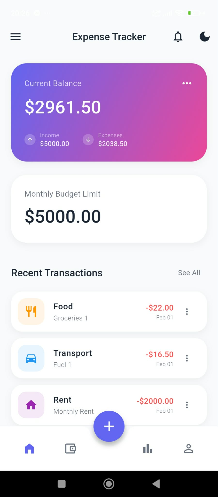
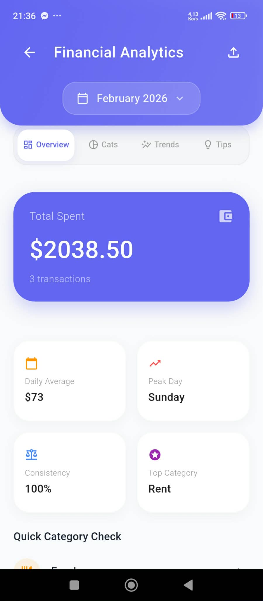
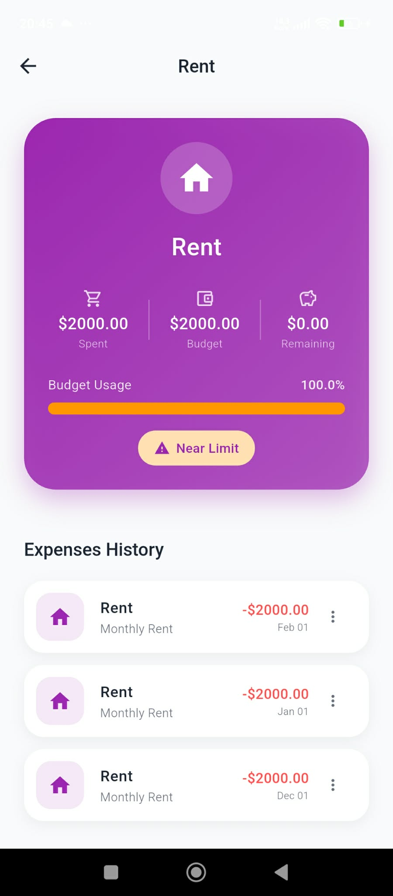
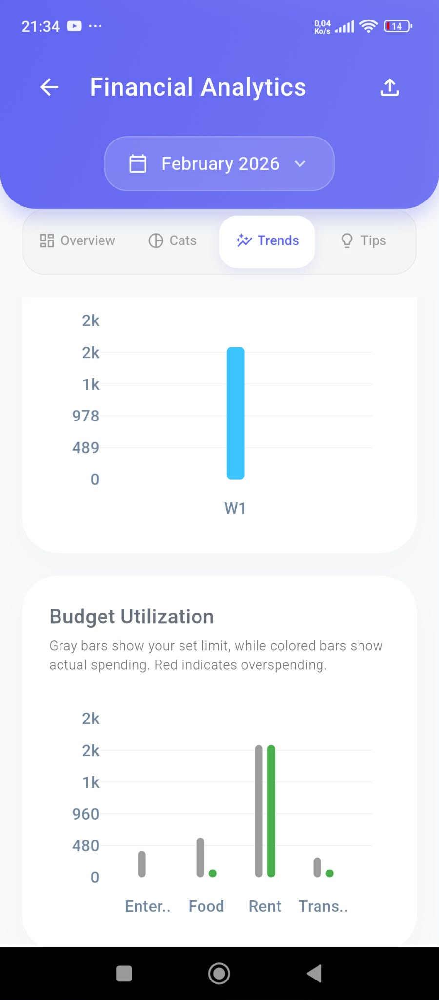
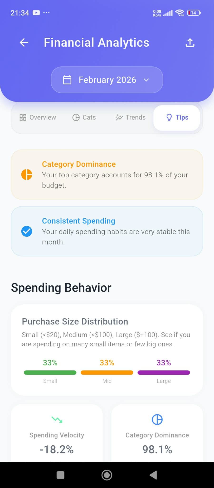
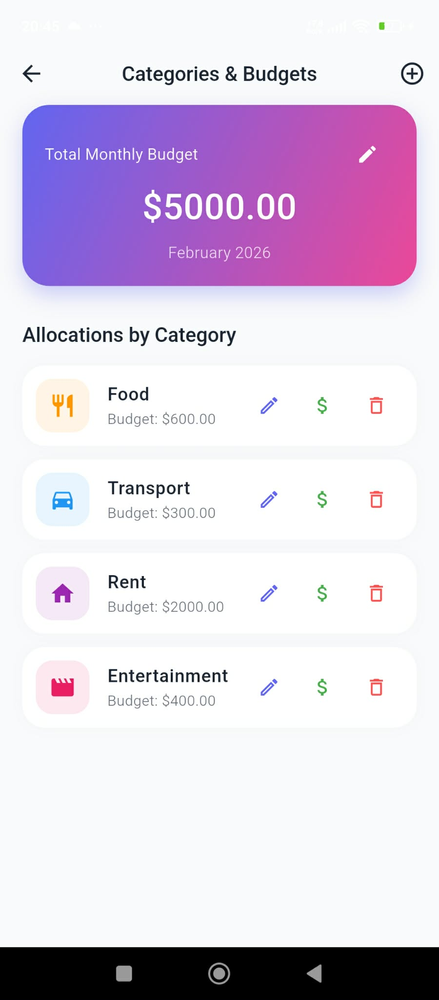
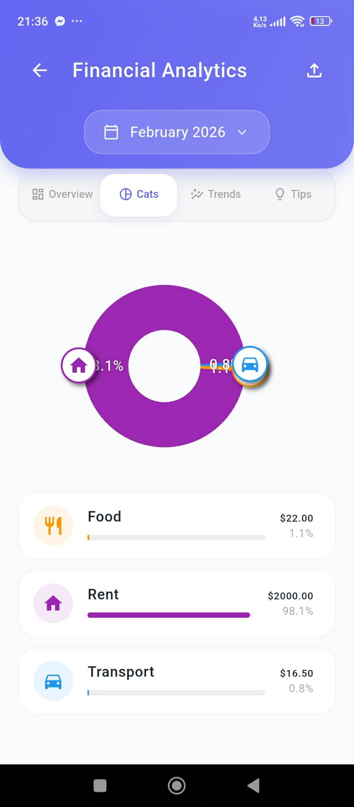
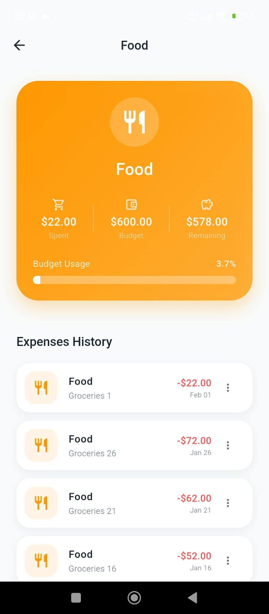

# 💰 Expense Tracker

[](https://flutter.dev)
[](https://firebase.google.com)
[](https://riverpod.dev)
[](https://opensource.org/licenses/MIT)

A modern, high-performance expense tracking application built with **Flutter** and **Firebase**. Take control of your finances with real-time tracking, beautiful analytics, biometric security, and cloud synchronization.

<p align="center">
  
</p>

---

## 📱 App Preview

<p align="center">
  
  
  
</p>

---

## ✨ Key Features

### 📊 Financial Management
- **Smart Tracking**: Log expenses with detailed metadata including categories, notes, and receipt images.
- **Dynamic Categorization**: Organize spending with customizable categories and intuitive icons.
- **Advanced Filtering**: Search through history and filter by category or date ranges.
- **Temporal Grouping**: Automated organization (Today, Yesterday, Last Week) for better readability.

### 📈 Analytics & Insights
- **Rich Visualizations**: Interactive spending charts powered by `FL Chart`.
- **Budget Tracking**: Real-time progress bars for monthly budget limits.
- **AI Recommendations**: Smart financial advice based on spending patterns.
- **Exportable Reports**: Generate professional PDF reports for your archives.

### 🔐 Security & Sync
- **Biometric Lock**: Secure your data with Fingerprint or Face ID via `local_auth`.
- **Cloud Real-time**: Instant synchronization across devices using `Cloud Firestore`.
- **Offline Mode**: Full functionality without internet access thanks to `SQLite` local caching.
- **Secure Vault**: sensitive data is encrypted using `flutter_secure_storage`.

---

## 📸 Detailed Screenshots

| Dashboard & Transactions | Analytics & Trends | Insight & Details |
| :---: | :---: | :---: |
|  |  |  |
| **Main Dashboard** | **Spending Trends** | **AI Insights** |
|  |  |  |
| **Category History** | **Weekly Breakdown** | **Category Analysis** |

---

## 🏗️ Architecture

The project follows **Clean Architecture** patterns, ensuring scalability and testability:

```text
lib/
├── core/               # Utilities, configuration, app-wide routes/theme
├── data/               # Data Layer: Models, repositories (impl), datasources
├── domain/             # Domain Layer: Entities, repository interfaces
└── presentation/       # UI Layer: Screens, widgets, Riverpod providers
```

---

## 🛠️ Tech Stack

- **Framework**: [Flutter](https://flutter.dev) (v3.9.2+)
- **State Management**: [Riverpod](https://riverpod.dev)
- **Database**: [Cloud Firestore](https://firebase.google.com/docs/firestore) & [SQLite](https://pub.dev/packages/sqflite)
- **Authentication**: [Firebase Auth](https://firebase.google.com/docs/auth)
- **Charts**: [FL Chart](https://pub.dev/packages/fl_chart)
- **Storage**: [Firebase Storage](https://firebase.google.com/docs/storage)
- **Security**: [Local Auth](https://pub.dev/packages/local_auth) & [Secure Storage](https://pub.dev/packages/flutter_secure_storage)

---

## 🚀 Getting Started

### Prerequisites

- [Flutter SDK](https://docs.flutter.dev/get-started/install) (3.9.2 or higher)
- [Firebase Account](https://console.firebase.google.com/)

### Installation

1. **Clone & Install**
   ```bash
   git clone https://github.com/samar14bh/Projet_Mobile_Expense_tracker_Gl4.git
   cd expense_tracker
   flutter pub get
   ```

2. **Firebase Configuration**
   - Place `google-services.json` in `android/app/`
   - Place `GoogleService-Info.plist` in `ios/Runner/`
   - Alternatively, use FlutterFire CLI:
     ```bash
     flutterfire configure
     ```

3. **Launch**
   ```bash
   flutter run
   ```

---

## 👥 Development Team

This project was crafted with passion by:

- 👤 **Eya Ben Ameur**
- 👤 **Oussema Guerami**
- 👤 **Hiba Chabbouh**
- 👤 **Samar Ben Houid**

---

## 🙏 Acknowledgments

- The Flutter Community for the incredible ecosystem.
- Our professors for guidance throughout the project.
- Open-source contributors whose libraries made this possible.

---

<p align="center">
  <b>Made with ❤️ by the GL4 Team</b>
</p>
